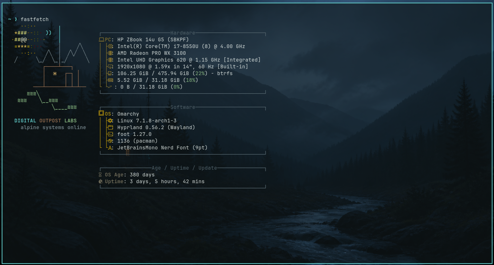
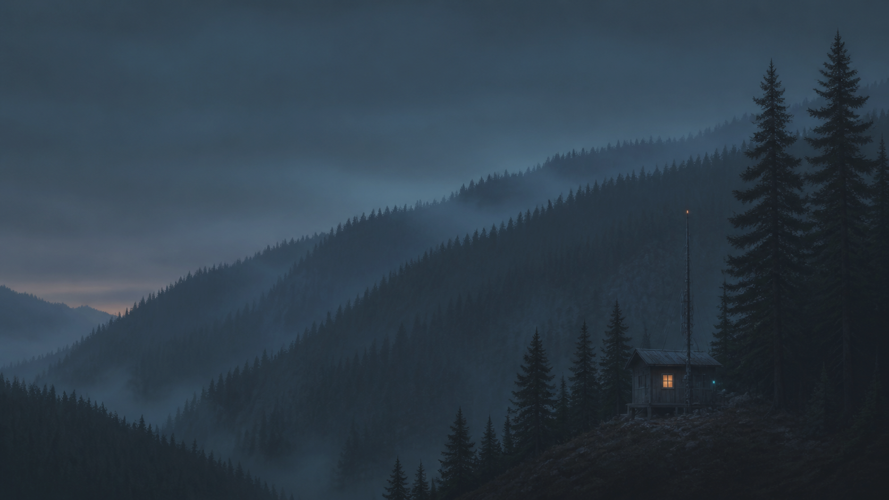
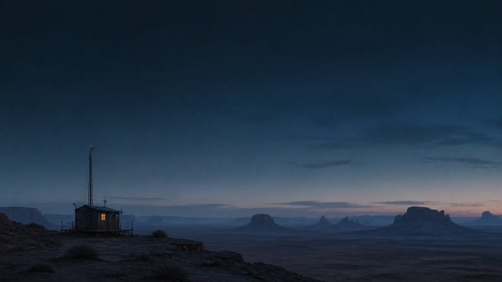

## Terminal Outpost Labs

Dark, minimalist Omarchy theme.

## Installation

Run command:
omarchy theme install https://github.com/RamenPacket84/terminal-outpost-labs.git

## Fastfetch

The optional Fastfetch configuration includes a custom Terminal Outpost Labs
terminal-art logo and matching colors.

After installing the theme with `omarchy theme install`, run:

```bash
(
set -e

THEME_SOURCE="$HOME/.config/omarchy/themes/terminal-outpost-labs"
FASTFETCH_TARGET="$HOME/.config/fastfetch"

if [ ! -f "$THEME_SOURCE/fastfetch/config.jsonc" ]; then
  echo "Terminal Outpost Labs Fastfetch files were not found."
  exit 1
fi

mkdir -p "$FASTFETCH_TARGET"

if [ -f "$FASTFETCH_TARGET/config.jsonc" ]; then
  cp "$FASTFETCH_TARGET/config.jsonc" \
     "$FASTFETCH_TARGET/config.jsonc.backup"
fi

cp "$THEME_SOURCE/fastfetch/terminal-outpost-labs.txt" \
   "$FASTFETCH_TARGET/terminal-outpost-labs.txt"

cp "$THEME_SOURCE/fastfetch/config.jsonc" \
   "$FASTFETCH_TARGET/config.jsonc"
)
```

Preview the result:

```bash
fastfetch
```

The included `config.jsonc` replaces your current Fastfetch layout. If an
existing configuration was backed up, restore it with:

```bash
if [ -f ~/.config/fastfetch/config.jsonc.backup ]; then
  mv ~/.config/fastfetch/config.jsonc.backup \
     ~/.config/fastfetch/config.jsonc
fi
```

If `fastfetch` does not display the new logo, check whether your shell is
overriding the command:

```bash
type -a fastfetch
```

## Wallpapers

Includes four wallpapers featuring alpine, wooded, stream, and desert outposts.

## Gallery

  ### Fastfetch

  

  ### Wallpapers

  #### Alpine outpost

  

  #### Wooded mountains

  

  #### Desert outpost

  

  #### Wooded mountain stream

  
